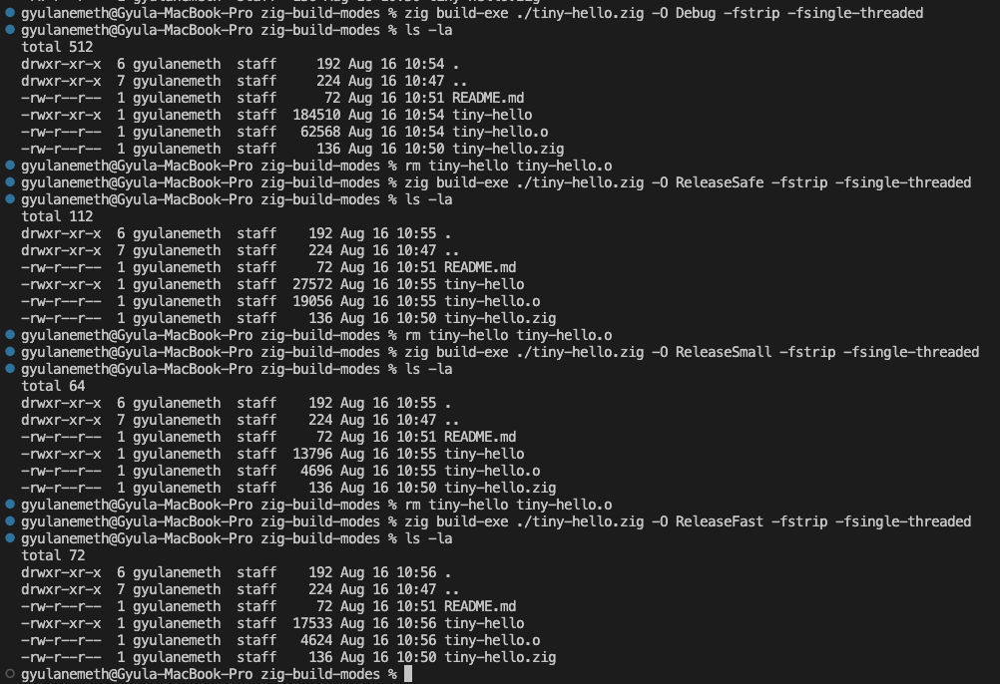

zig build-exe ./tiny-hello.zig -O Debug -fstrip -fsingle-threaded
zig build-exe ./tiny-hello.zig -O ReleaseSafe -fstrip -fsingle-threaded
zig build-exe ./tiny-hello.zig -O ReleaseSmall -fstrip -fsingle-threaded
zig build-exe ./tiny-hello.zig -O ReleaseFast -fstrip -fsingle-threaded

Results on my mac:

Cross compilation to 64 bit arm linux (eg. my raspberry pi):
zig build-exe .\tiny-hello.zig -O ReleaseSmall -fstrip -fsingle-threaded -target aarch64-linux

The executable is 3x smaller than on my Mac!